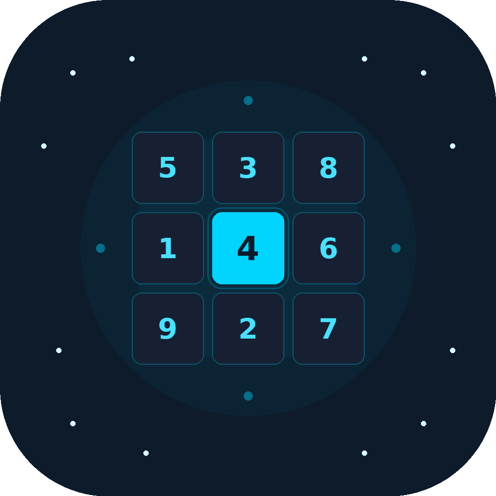
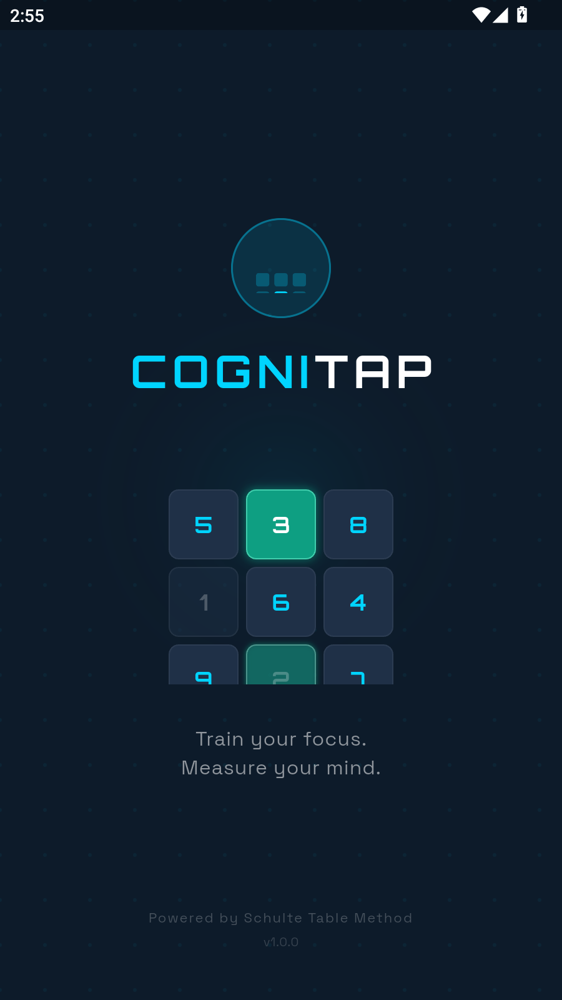
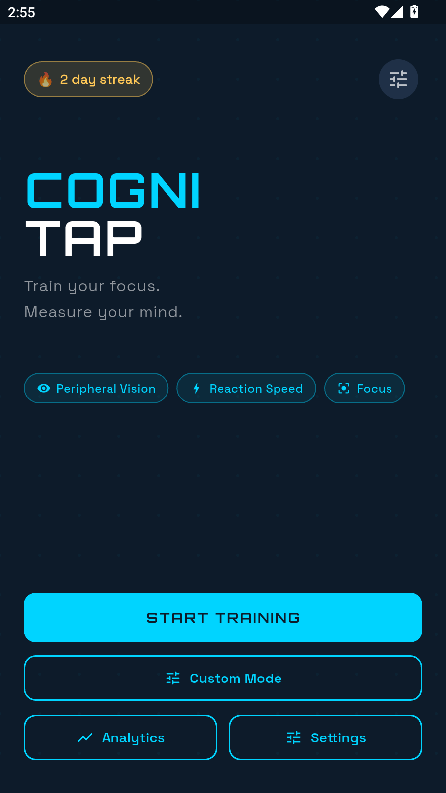
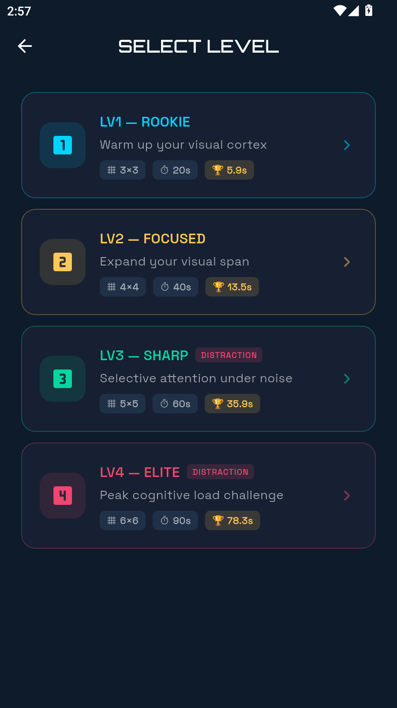
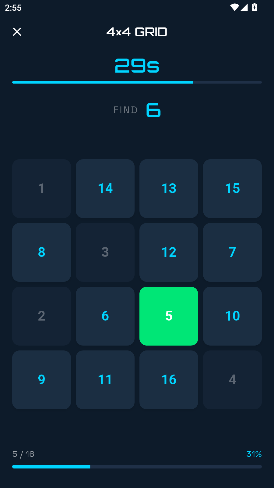
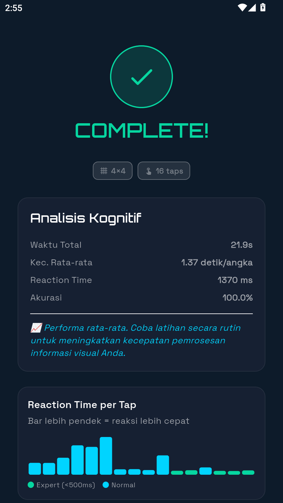
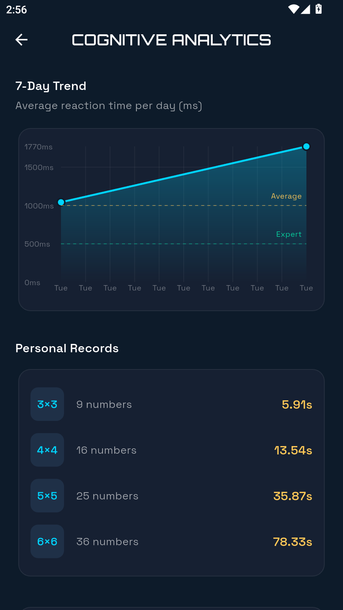
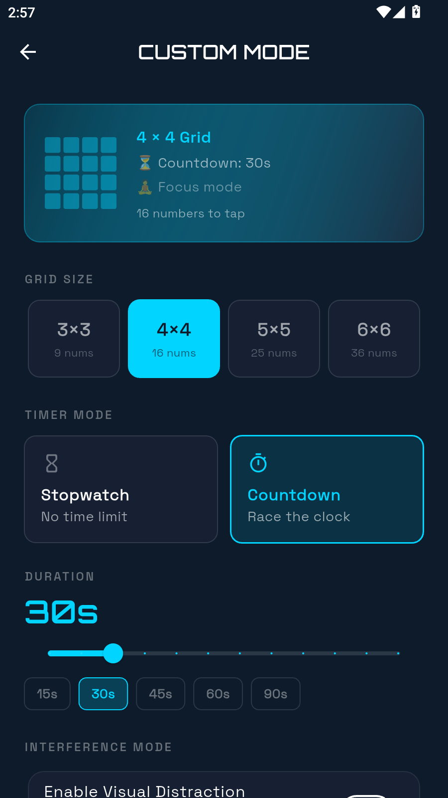

# 🧠 CogniTap — Cognitive Training via Schulte Table

<p align="center">
  
</p>

<p align="center">
  
  
  
  
  
  
</p>

> Aplikasi latihan kognitif berbasis metode **Schulte Table** — melatih fokus, kecepatan reaksi visual, dan peripheral vision. Dilengkapi analytics dashboard, data export untuk penelitian, dan sistem daily streak untuk membangun kebiasaan latihan otak harian.

---

## 📱 Screenshots

| Splash | Home | Level Select | Game | Result | Analytics | Custom Mode |
|:------:|:----:|:------------:|:----:|:------:|:---------:|:-----------:|
|  |  |  |  |  |  |  |

---

## ✨ Fitur Utama

### 🎯 Core Gameplay — Schulte Table Mechanic
- Grid angka acak yang diacak menggunakan **Fisher-Yates shuffle** setiap sesi
- User mengetuk angka **secara berurutan** dari 1 hingga N
- Efek visual: kotak hijau ✅ jika benar, animasi **shake** + merah ❌ jika salah
- **Haptic feedback** untuk setiap ketukan (benar & salah)
- Progress bar real-time menampilkan kemajuan sesi

### 📐 Grid Size & Level System
- **4 ukuran grid**: 3×3 (9 angka) → 4×4 (16) → 5×5 (25) → 6×6 (36)
- **4 level preset** dengan tingkat kesulitan progresif:
  - `LV1 ROOKIE` — Grid 3×3, 20 detik
  - `LV2 FOCUSED` — Grid 4×4, 40 detik
  - `LV3 SHARP` — Grid 5×5, 60 detik + Interference Mode
  - `LV4 ELITE` — Grid 6×6, 90 detik + Interference Mode
- **Custom Mode** — pilih sendiri grid size, timer mode, durasi, dan interference toggle

### ⚡ Interference Mode *(Selective Attention Training)*
- Warna latar belakang setiap sel berubah acak setiap **1.5 detik**
- Didasarkan pada **Stroop Effect** — stimulus warna yang tidak relevan
  melatih kemampuan *selective attention* (perhatian selektif)
- Tersedia mulai Level 3 dan bisa diaktifkan manual di Custom Mode

### ⏱️ Dual Timer Mode
- **Countdown** — selesaikan grid sebelum waktu habis (10–120 detik, adjustable)
- **Stopwatch** — seberapa cepat kamu bisa menyelesaikan tanpa batas waktu
- Timer countdown berubah warna: **cyan** → **amber** → **merah** saat mendekati habis

### 📊 Cognitive Analytics Dashboard
- **7-day trend chart** menggunakan `fl_chart` — grafik garis reaction time rata-rata
- **3 threshold zone** berdasarkan penelitian kecepatan pemrosesan visual:
  - 🟢 Expert: < 500ms
  - 🔵 Good: 500–1000ms
  - 🟡 Average: 1000–2000ms
  - 🔴 Fatigued: > 2000ms
- **Personal Records** (high score) per ukuran grid
- Tabel cognitive zone legend dengan penjelasan psikologis

### 🔬 Research & Data Export *(Health-Tech Value)*
- Log detail setiap ketukan: `expectedNumber`, `tappedNumber`, `timestamp`, `reactionTimeMs`
- **Export ke CSV** — format siap dianalisis di SPSS, Python/Pandas, atau R
- Metadata sesi lengkap: durasi total, rata-rata reaction time, akurasi, interference mode
- Dirancang untuk keperluan **terapis kognitif** dan **penelitian ilmiah**

### 📈 Post-Game Performance Summary
- **Rata-rata reaction time** dalam milidetik
- **Kecepatan per angka** (detik/angka)
- **Akurasi ketukan** (%)
- **Mini bar chart** reaction time per tap — visualisasi "ritme kognitif" user
- Feedback psikologis otomatis berdasarkan performa ("Luar biasa! Peripheral vision sangat terlatih.")
- Deteksi **new record** otomatis

### 🔥 Daily Brain Habit
- **Streak counter** harian — catat berapa hari berturut-turut user berlatih
- Minimum 1 sesi per hari untuk menjaga streak
- Indikator streak di Home screen (🔥 N day streak / 💤 No streak)
- Konsisten dengan prinsip *spaced practice* dalam teori pembelajaran

---

## 🧠 Landasan Psikologi Kognitif

| Konsep | Implementasi di CogniTap |
|--------|--------------------------|
| **Schulte Table** (1920) | Mekanisme grid utama — melatih peripheral vision |
| **Cognitive Load Theory** (Sweller, 1988) | Grid 5×5 sebagai "sweet spot" tanpa cognitive overload |
| **Stroop Effect** | Interference Mode — warna berubah mengganggu selektif attention |
| **Spaced Practice** | Daily streak mendorong latihan konsisten |
| **Reaction Time Research** | Threshold 500ms/1000ms/2000ms berdasarkan studi visual search |
| **Processing Speed** | Metrik utama: reaction time per ketukan benar |

---

## 🛠️ Tech Stack

| Layer | Teknologi |
|-------|-----------|
| **Framework** | Flutter 3.27+ |
| **Language** | Dart 3.0+ |
| **State Management** | Riverpod 2.x (StateNotifier) |
| **Navigation** | GoRouter 14.x |
| **Charts** | FL Chart 0.68+ |
| **Local Storage** | SharedPreferences |
| **File Export** | path_provider + share_plus |
| **Fonts** | Google Fonts (Orbitron + Space Grotesk) |

---

## 📁 Arsitektur Project

    lib/
    ├── core/
    │   ├── constants/
    │   │   ├── app_colors.dart
    │   │   ├── app_theme.dart
    │   │   └── cognitive_constants.dart    # Konstanta psikologi kognitif
    │   ├── router/
    │   │   └── app_router.dart
    │   └── utils/
    │       └── csv_exporter.dart           # Export data untuk peneliti
    ├── data/
    │   ├── models/
    │   │   ├── tap_record.dart             # Log setiap ketukan (ms-level)
    │   │   ├── game_session.dart           # Satu sesi permainan lengkap
    │   │   ├── game_settings.dart          # Konfigurasi grid & timer
    │   │   └── daily_streak.dart
    │   └── repositories/
    │       ├── score_repository.dart       # High scores per grid size
    │       ├── session_repository.dart     # History sesi (JSON via SharedPrefs)
    │       └── streak_repository.dart
    ├── providers/
    │   ├── game_provider.dart              # Core game logic & state
    │   ├── settings_provider.dart
    │   ├── analytics_provider.dart         # Agregasi 7-day data
    │   └── streak_provider.dart
    └── presentation/
        ├── screens/
        │   ├── splash_screen.dart          # Animated intro dengan mini Schulte demo
        │   ├── home_screen.dart
        │   ├── level_select_screen.dart
        │   ├── game_screen.dart            # Main gameplay
        │   ├── custom_mode_screen.dart     # Free-play configuration
        │   ├── result_screen.dart          # Post-game analytics
        │   ├── analytics_screen.dart       # 7-day dashboard
        │   └── settings_screen.dart
        └── widgets/
            ├── schulte_grid.dart
            ├── number_cell.dart            # Animasi correct/wrong/shake
            ├── timer_display.dart
            ├── streak_badge.dart
            └── performance_summary.dart

---

## 🚀 Cara Install & Menjalankan

### Prerequisites

- Flutter SDK >= 3.27.0
- Dart SDK >= 3.0.0
- Android Studio / VS Code
- Android SDK (untuk Android) atau Xcode (untuk iOS)

### Clone & Setup

    git clone https://github.com/username/cognitap.git
    cd cognitap
    flutter pub get
    flutter run

### Build Release APK

    flutter build apk --release

File APK tersimpan di:

    build/app/outputs/flutter-apk/app-release.apk

### Build iOS

    flutter build ios --release

---

## 📊 Model Data — Untuk Peneliti

### `TapRecord` — Unit terkecil analisis kognitif

```dart
class TapRecord {
  final int expectedNumber;    // Angka yang seharusnya ditekan
  final int tappedNumber;      // Angka yang benar-benar ditekan
  final DateTime timestamp;    // Waktu absolut ketukan (ISO 8601)
  final int? reactionTimeMs;   // Jeda sejak ketukan benar sebelumnya (ms)
  bool get isCorrect => expectedNumber == tappedNumber;
}
```

### Format CSV Export

```
session_id, grid_size, start_time, total_duration_s, avg_reaction_time_ms,
accuracy_pct, interference_mode, expected_number, tapped_number,
timestamp, reaction_time_ms, result
```

---

## 📋 Game Logic

### Fisher-Yates Shuffle (Spatial Randomization)

    Setiap sesi: angka 1..N diacak posisinya di grid
    → Mencegah hafalan posisi (muscle memory)
    → Memaksa otak menggunakan peripheral vision aktif
    → Konsisten dengan prinsip Schulte Table asli (1920)

### Reaction Time Calculation

    reactionTimeMs = timestamp_ketukan_benar_N
                   - timestamp_ketukan_benar_(N-1)

    → Hanya dihitung untuk ketukan BENAR
    → Ketukan salah dilog tapi tidak mempengaruhi RT calculation
    → Tap pertama setiap sesi = null (tidak ada referensi sebelumnya)

### High Score System

    Skor lebih baik = waktu LEBIH CEPAT (ascending)
    Key: "high_score_{gridSize}" di SharedPreferences
    Scope: per ukuran grid (3x3, 4x4, 5x5, 6x6 masing-masing independen)

---

## 🎨 Design System

| Token | Value |
|-------|-------|
| Background | `#0D1B2A` (Deep Navy) |
| Primary | `#00D4FF` (Electric Cyan) |
| Secondary | `#FFC857` (Amber) |
| Tertiary/Success | `#06D6A0` (Teal Green) |
| Error | `#EF476F` (Coral Red) |
| Surface | `#162032` |
| Font Display | Orbitron (Google Fonts) |
| Font Body | Space Grotesk (Google Fonts) |

---

## 🤝 Kontribusi

Pull request sangat disambut! Untuk perubahan besar, silakan buka issue terlebih dahulu.

1. Fork repository
2. Buat branch fitur: `git checkout -b feature/NamaFitur`
3. Commit perubahan: `git commit -m 'Add: NamaFitur'`
4. Push ke branch: `git push origin feature/NamaFitur`
5. Buat Pull Request

---

## 📄 Lisensi

```
Copyright 2026 CogniTap

Licensed under the Apache License, Version 2.0 (the "License");
you may not use this file except in compliance with the License.
You may obtain a copy of the License at

    http://www.apache.org/licenses/LICENSE-2.0

Unless required by applicable law or agreed to in writing, software
distributed under the License is distributed on an "AS IS" BASIS,
WITHOUT WARRANTIES OR CONDITIONS OF ANY KIND, either express or implied.
See the License for the specific language governing permissions and
limitations under the License.
```

---

<p align="center">
  Built with ❤️ using Flutter · Inspired by Cognitive Psychology Research
</p>
